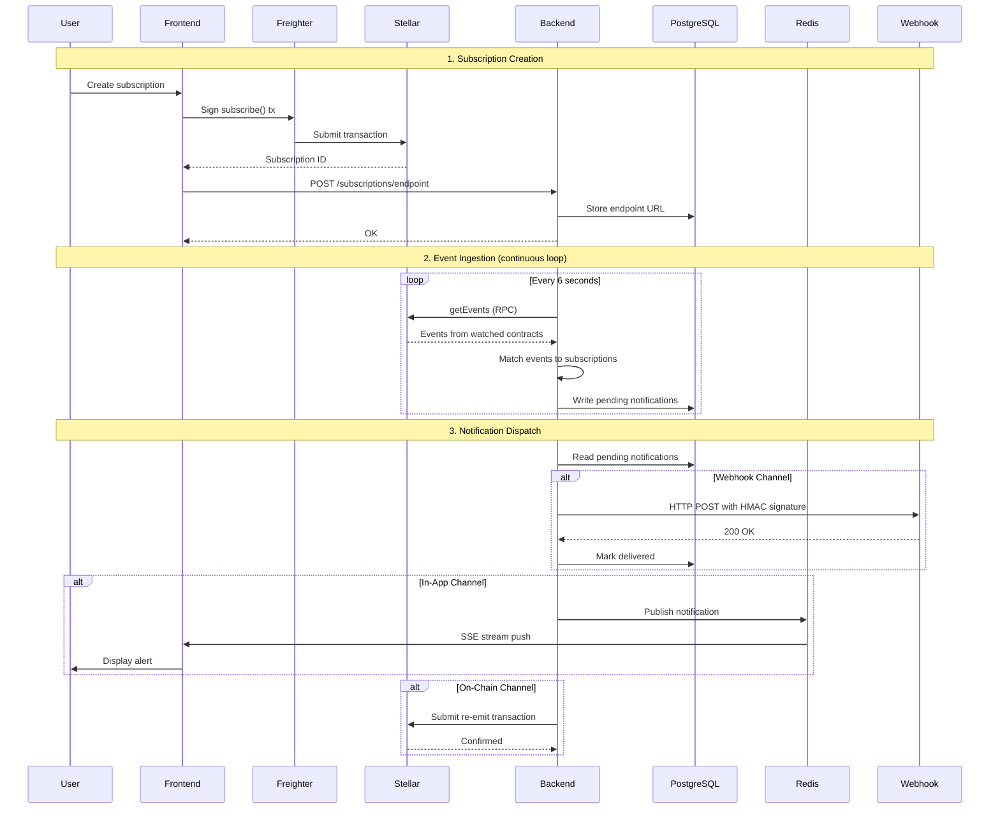

# Architecture

## Overview

```
┌─────────────────────────────────────────────────────────────┐
│                    Stellar Network                          │
│                                                             │
│  ┌─────────────────────┐    ┌──────────────────────────┐   │
│  │  Any Soroban        │    │  StellarNotify           │   │
│  │  Contract           │───▶│  Registry Contract       │   │
│  │  (watched)          │    │  (subscriptions on-chain)│   │
│  └─────────────────────┘    └──────────┬───────────────┘   │
└────────────────────────────────────────┼────────────────────┘
                                         │
                    ┌────────────────────▼──────────────────┐
                    │         StellarNotify Backend         │
                    │                                       │
                    │  ┌─────────────┐  ┌───────────────┐  │
                    │  │  Event      │  │  Webhook      │  │
                    │  │  Ingester   │  │  Dispatcher   │  │
                    │  └──────┬──────┘  └───────┬───────┘  │
                    │         │                 │           │
                    │  ┌──────▼─────────────────▼───────┐  │
                    │  │     PostgreSQL + Redis          │  │
                    │  └─────────────────────────────────┘  │
                    │                                       │
                    │  ┌─────────────────────────────────┐  │
                    │  │  REST API + SSE endpoints        │  │
                    │  └─────────────────────────────────┘  │
                    └───────────────────────────────────────┘
                                         │
                    ┌────────────────────▼──────────────────┐
                    │        StellarNotify Frontend         │
                    │  Next.js · Freighter · TanStack Query │
                    └───────────────────────────────────────┘
```

## Data Flow

1. **Subscription created** — User signs a `subscribe()` transaction via Freighter. The subscription is stored in the Soroban registry contract (persistent storage).

2. **Event ingestion** — The backend polls `getEvents` from the Stellar RPC on a 6-second interval. All events from watched contracts are matched against active subscriptions.

3. **Notification dispatch** — Matched events are written to PostgreSQL as `pending` notifications, then dispatched:
   - **Webhook**: HTTP POST with retry + exponential back-off
   - **In-App**: Published to Redis pub/sub → SSE stream to browser
   - **On-Chain**: A re-emit transaction is submitted back to Stellar

4. **Frontend** — The dashboard reads subscription data from the backend REST API. The notification feed combines polled data with live SSE updates.

## Sequence Diagram



## Storage

| Layer | What is stored |
|---|---|
| Soroban contract | Subscription definitions, owner/watcher indexes |
| PostgreSQL | Mirror of subscriptions, notification records, cursor |
| Redis | Pub/sub channels for real-time in-app delivery |

## Security Model

See the [Security Model](./security.md) page.
