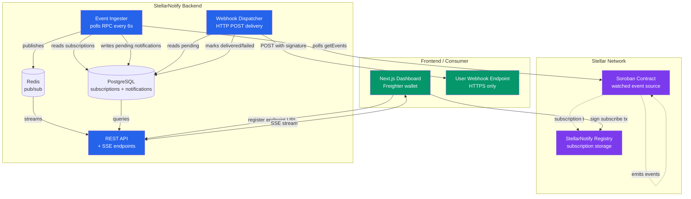
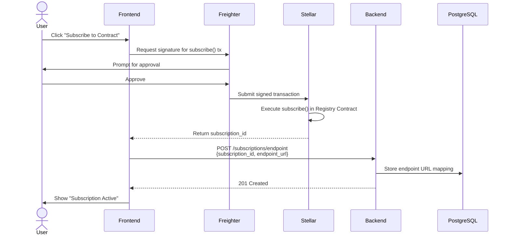
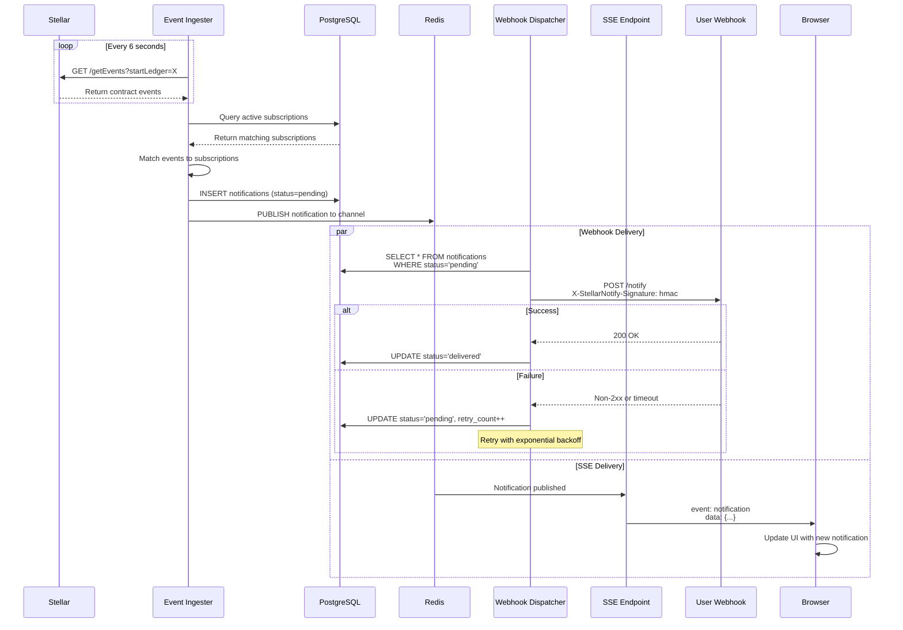
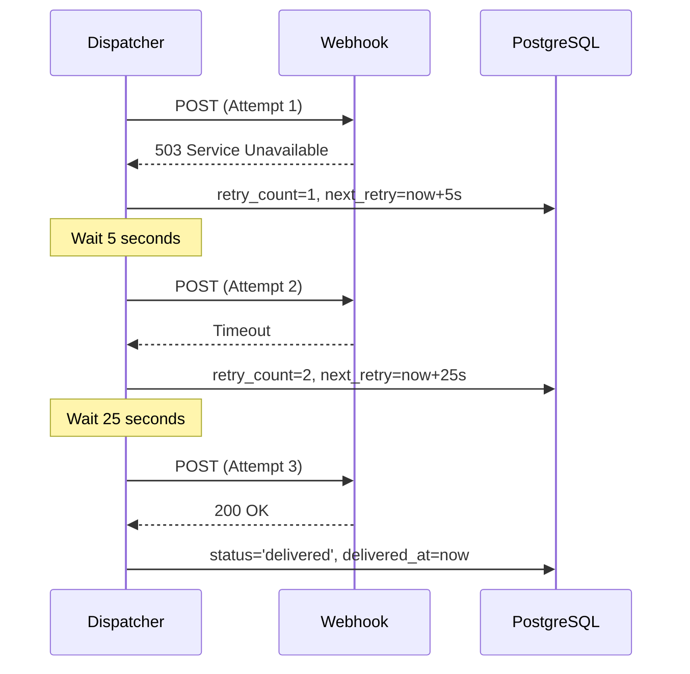

# Architecture

## Overview

StellarNotify is a notification infrastructure for Soroban smart contracts. It consists of on-chain subscription management, off-chain event processing, and multi-channel delivery (webhooks, SSE, on-chain re-emit).

```mermaid
graph TB
    subgraph "Stellar Network"
        SC[Soroban Contract<br/>watched event source]
        RC[StellarNotify Registry<br/>subscription storage]
        SC -.emits events.-> SC
        SC -.subscription tx.-> RC
    end

    subgraph "StellarNotify Backend"
        EI[Event Ingester<br/>polls RPC every 6s]
        PG[(PostgreSQL<br/>subscriptions + notifications)]
        RD[(Redis<br/>pub/sub)]
        WD[Webhook Dispatcher<br/>HTTP POST delivery]
        API[REST API<br/>+ SSE endpoints]
        
        EI -->|polls getEvents| SC
        EI -->|reads subscriptions| PG
        EI -->|writes pending notifications| PG
        EI -->|publishes| RD
        
        WD -->|reads pending| PG
        WD -->|marks delivered/failed| PG
        
        RD -->|streams| API
        PG -->|queries| API
    end

    subgraph "Frontend / Consumer"
        FE[Next.js Dashboard<br/>Freighter wallet]
        WH[User Webhook Endpoint<br/>HTTPS only]
        
        FE -->|sign subscribe tx| RC
        FE -->|register endpoint URL| API
        FE <-->|SSE stream| API
        
        WD -->|POST with signature| WH
    end

    style SC fill:#7c3aed,color:#fff
    style RC fill:#7c3aed,color:#fff
    style EI fill:#2563eb,color:#fff
    style WD fill:#2563eb,color:#fff
    style API fill:#2563eb,color:#fff
    style FE fill:#059669,color:#fff
    style WH fill:#059669,color:#fff
```

### Component Responsibilities

| Component | Purpose | Technology |
|-----------|---------|------------|
| **Registry Contract** | Store subscriptions on-chain with owner/watcher indexes | Soroban (Rust) |
| **Event Ingester** | Poll Stellar RPC, match events to subscriptions, enqueue notifications | Node.js + PostgreSQL |
| **Webhook Dispatcher** | Deliver notifications via HTTP POST with retry + exponential backoff | Node.js + Queue |
| **REST API** | Manage subscriptions, query notification history | Express.js |
| **SSE Endpoint** | Stream real-time notifications to browser clients | Server-Sent Events |
| **Frontend** | User dashboard for managing subscriptions | Next.js + Freighter |

## Data Flow

The complete lifecycle from subscription creation to notification delivery involves multiple components working together.

### 1. Subscription Creation Flow

```mermaid
sequenceDiagram
    actor User
    participant Frontend
    participant Freighter
    participant Stellar
    participant Backend
    participant PostgreSQL

    User->>Frontend: Click "Subscribe to Contract"
    Frontend->>Freighter: Request signature for subscribe() tx
    Freighter->>User: Prompt for approval
    User->>Freighter: Approve
    Freighter->>Stellar: Submit signed transaction
    Stellar->>Stellar: Execute subscribe() in Registry Contract
    Stellar-->>Frontend: Return subscription_id
    
    Frontend->>Backend: POST /subscriptions/endpoint<br/>{subscription_id, endpoint_url}
    Backend->>PostgreSQL: Store endpoint URL mapping
    Backend-->>Frontend: 201 Created
    
    Frontend->>User: Show "Subscription Active"
```

**Key Steps:**

1. **User** creates a subscription via the **Frontend**
2. **Frontend** requests **Freighter** to sign the transaction
3. **Freighter** submits the signed transaction to **Stellar**
4. Transaction confirms on-chain with a subscription ID
5. **Frontend** registers the webhook URL with the **Backend** API
6. **Backend** stores the URL in **PostgreSQL**

### 2. Event Delivery Flow

```mermaid
sequenceDiagram
    participant Stellar
    participant Ingester as Event Ingester
    participant PG as PostgreSQL
    participant Redis
    participant Dispatcher as Webhook Dispatcher
    participant SSE as SSE Endpoint
    participant Webhook as User Webhook
    participant Browser

    loop Every 6 seconds
        Ingester->>Stellar: GET /getEvents?startLedger=X
        Stellar-->>Ingester: Return contract events
    end

    Ingester->>PG: Query active subscriptions
    PG-->>Ingester: Return matching subscriptions
    
    Ingester->>Ingester: Match events to subscriptions
    
    Ingester->>PG: INSERT notifications (status=pending)
    Ingester->>Redis: PUBLISH notification to channel
    
    par Webhook Delivery
        Dispatcher->>PG: SELECT * FROM notifications<br/>WHERE status='pending'
        Dispatcher->>Webhook: POST /notify<br/>X-StellarNotify-Signature: hmac
        alt Success
            Webhook-->>Dispatcher: 200 OK
            Dispatcher->>PG: UPDATE status='delivered'
        else Failure
            Webhook-->>Dispatcher: Non-2xx or timeout
            Dispatcher->>PG: UPDATE status='pending', retry_count++
            Note over Dispatcher: Retry with exponential backoff
        end
    and SSE Delivery
        Redis->>SSE: Notification published
        SSE->>Browser: event: notification<br/>data: {...}
        Browser->>Browser: Update UI with new notification
    end
```

**Key Steps:**

7. **Ingester** polls **Stellar** RPC for new events every 6 seconds
8. **Ingester** matches events against subscriptions in **PostgreSQL**
9. For matched events:
   - **Webhook channel**: Ingester writes `pending` notification to PostgreSQL, Dispatcher sends HTTP POST
   - **In-App channel**: Ingester publishes to **Redis**, which streams to **Browser** via SSE
   - **On-Chain channel**: Ingester submits a re-emit transaction to **Stellar**

### 3. Webhook Retry Flow

```mermaid
sequenceDiagram
    participant Dispatcher
    participant Webhook
    participant PostgreSQL

    Dispatcher->>Webhook: POST (Attempt 1)
    Webhook-->>Dispatcher: 503 Service Unavailable
    Dispatcher->>PostgreSQL: retry_count=1, next_retry=now+5s

    Note over Dispatcher: Wait 5 seconds

    Dispatcher->>Webhook: POST (Attempt 2)
    Webhook-->>Dispatcher: Timeout
    Dispatcher->>PostgreSQL: retry_count=2, next_retry=now+25s

    Note over Dispatcher: Wait 25 seconds

    Dispatcher->>Webhook: POST (Attempt 3)
    Webhook-->>Dispatcher: 200 OK
    Dispatcher->>PostgreSQL: status='delivered', delivered_at=now
```

**Retry Schedule:**

| Attempt | Delay |
|---|---|
| 1st retry | 5 s |
| 2nd retry | 25 s |
| 3rd retry | 2 min |
| 4th retry | 10 min |
| 5th retry | 30 min |

After 5 failed attempts the notification is marked `failed` and no further retries are attempted.

## Storage

| Layer | What is stored |
|---|---|
| Soroban contract | Subscription definitions, owner/watcher indexes |
| PostgreSQL | Mirror of subscriptions, notification records, cursor |
| Redis | Pub/sub channels for real-time in-app delivery |

## Security Model

See the [Security Model](./security.md) page.
